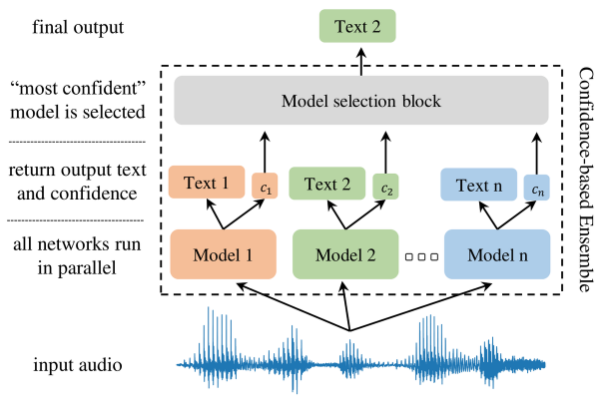
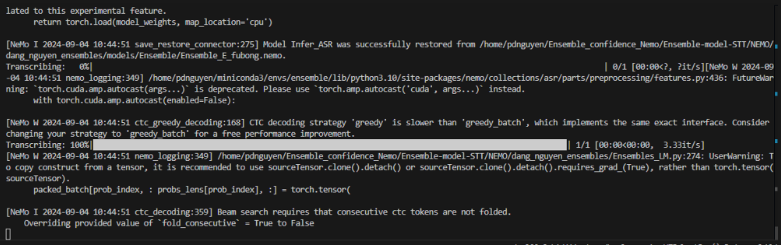
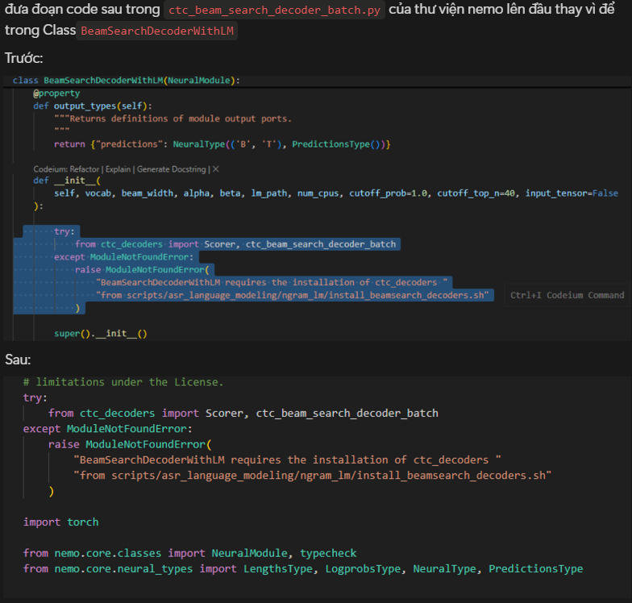

# Overview
Không có một model nào có thể làm tốt trên tất cả các language. Các model chỉ có thể được fine-tune cho một số ngôn ngữ + nhiệm vụ nhất định. Vậy làm sao để có thể tạo ra một model đa nhiệm infer tốt trên all domains? Đây là lúc cần đến phương pháp Ensemble.

Ensemble có nhiều phương pháp nhưng hiện tại Nemo chỉ đang support phương pháp confidence-based ensemble. Bao gồm:

1. Kết hợp các models thành phần tạo thành một Ensembles.
2. Tính toán confidence.
3. Lựa chọn model infer thông qua selection block.

* Mục tiêu selection block là chọn model phù hợp cho từng đầu vào, vậy nên nó được train như một task classification (Ở đây các confidence không phải là tuyệt đối nên ta cần train LR thay vì if else chọn model cho max confidence). 


# Practice
## Training ensembles
Để training ra một ensemble model cần ít nhất 2 model + 2 metadata cấu trúc như sau: 

* Model 1 sẽ hoạt động tốt trên metadata 1
* Model 2 sẽ hoạt động tốt trên metadata 2

=> Sau đó setup trong .yaml file như sau để có thể train
```bash
ensemble:
  - model: stt_en_fastconformer_ctc_large
    training_manifest: ${oc.env:TEST_DATA_PATH}/es/train_manifest.json
  - model: stt_en_fastconformer_ctc_large
    training_manifest: ${oc.env:TEST_DATA_PATH}/it/train_manifest.json
  # - model: stt_en_fastconformer_ctc_large
  #   training_manifest: ${oc.env:TEST_DATA_PATH}/it/train_manifest.json
output_path: confidence-ensemble.nemo

# this is default
temperature: 1.0

# this is default
confidence:
    exclude_blank: True
    aggregation: mean
    method_cfg:
        name: entropy
        entropy_type: renyi
        alpha: 0.25
        entropy_norm: lin
```
Ở đây ta chỉ kết hợp 2 model nên số lượng model và train_manifest sẽ là 2.
### Bug trong quá trình training
Nếu xuất hiện lỗi ```TypeError: ConfidenceConfig.__init__() got an unexpected keyword argument 'measure_cfg``` thì có nghĩa là version Nemo khi training model của bạn không giống với version Nemo khi ensemble. Lúc này chỉ cần sử dụng file code ```convert_model_replace_meansure_by_method.py``` để thay thế "measure_cfg" thành "method_cfg" và Overwrite lại model là được.

#### Bị treo khi infer model:
Nguyên nhân: Pip thêm thư viện => Thư viện cũ của nemo bị overwrite

Giải quyết:

## Infer Ensemble
Note: Ở version 1.0 sẽ chỉ cho phép infer theo path model thay vì infer trực tiếp theo signal audio.
### Infer without LM
Infer ở đây khá đơn giản là không cần LM. Ensemble sẽ chỉ định model nào là model phù hợp với input đầu vào.
Chạy file ```infer_norml.py``` và thay path audio vào để chạy ensemble.

### Infer with LM
Infer phức tạp hơn nhưng độ chính xác cao hơn khi kết hợp LM với fastconformer. Lưu ý với model English thì LM phải được train với data English và với Vietnamese cũng vậy.

=> cần bộ 2 model và 2 LM để có thể kết hợp infer.

Chạy file ```Ensembles_LM.py``` và thay path audio vào để chạy ensemble.